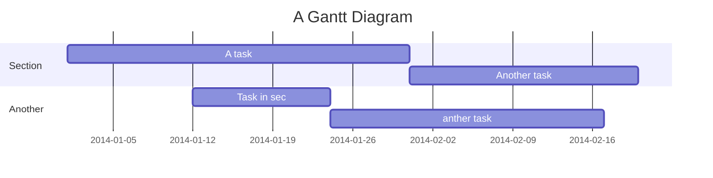

Projeto de sistema de controle de Ordens de Serviço
===

## Table of Contents

[TOC]

## Descrição do Projeto

 - Desenvolver um sistema para gerencia ordens de serviço para uma industria ou comercio, onde tiver manutendores atuando.
 - Sistema será desenvolvido no back end em node.js e front end em React !


## Descrição de Criterios
 
#### Descrição inicial dos criterios
- Tela para Login para Gerentes, programador de manutenção, Manutendores  e Produção.
- Produção vai ter login para abrir ordens de serviço.
- Manutendores vai ter uma tela onde vai funcionar com um diario, onde ele vai descrever o seu dia colocar os numeros de ordens de serviço atendidos
- Programador de manutenção vai abrir ordens de serviço para preventiva e preditivas, vai ter acesso a tela de controle de horas dos manutentores, vai poder criar acesso a produção e as manutentores .
- Gerentes vai ter acesso total a todas as telas

#### Descrição das telas

- **Tela de Login -** Tela para login de todos os usuarios do sistema
- **Tela Home -** Vai mostrar todas as ordens apertas, Vai ter icone para abrir Ordens de serviços caso o login for feito pela produção , caso feito pelo manutentor vai ter icone para diario do dia, Gerente e manutentor vai ter acesso a todos os icones
- **Tela Ordens de Serviços -** 
- - Campo Numero da ordens = gerado automatico na seguencia 
- - Campo Nome quem abriu a ordem pelo login
- - Setor onde vai ser feito a manutenção, 


User story
---

```gherkin=
Feature: Guess the word

  # The first example has two steps
  Scenario: Maker starts a game
    When the Maker starts a game
    Then the Maker waits for a Breaker to join

  # The second example has three steps
  Scenario: Breaker joins a game
    Given the Maker has started a game with the word "silky"
    When the Breaker joins the Maker's game
    Then the Breaker must guess a word with 5 characters
```
> I choose a lazy person to do a hard job. Because a lazy person will find an easy way to do it. [name=Bill Gates]


```gherkin=
Feature: Shopping Cart
  As a Shopper
  I want to put items in my shopping cart
  Because I want to manage items before I check out

  Scenario: User adds item to cart
    Given I'm a logged-in User
    When I go to the Item page
    And I click "Add item to cart"
    Then the quantity of items in my cart should go up
    And my subtotal should increment
    And the warehouse inventory should decrement
```

> Read more about Gherkin here: https://docs.cucumber.io/gherkin/reference/

User flows
---
```sequence
Alice->Bob: Hello Bob, how are you?
Note right of Bob: Bob thinks
Bob-->Alice: I am good thanks!
Note left of Alice: Alice responds
Alice->Bob: Where have you been?
```

> Read more about sequence-diagrams here: http://bramp.github.io/js-sequence-diagrams/

Project Timeline
---


> Read more about mermaid here: http://mermaid-js.github.io/mermaid/

## Appendix and FAQ

:::info
**Find this document incomplete?** Leave a comment!
:::

###### tags: `Templates` `Documentation`
