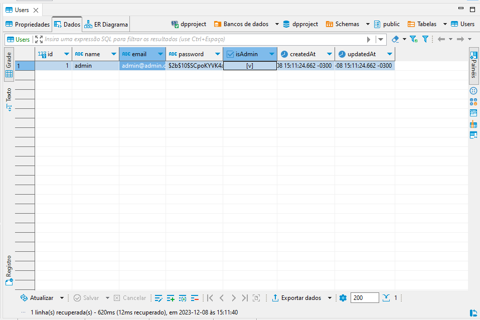
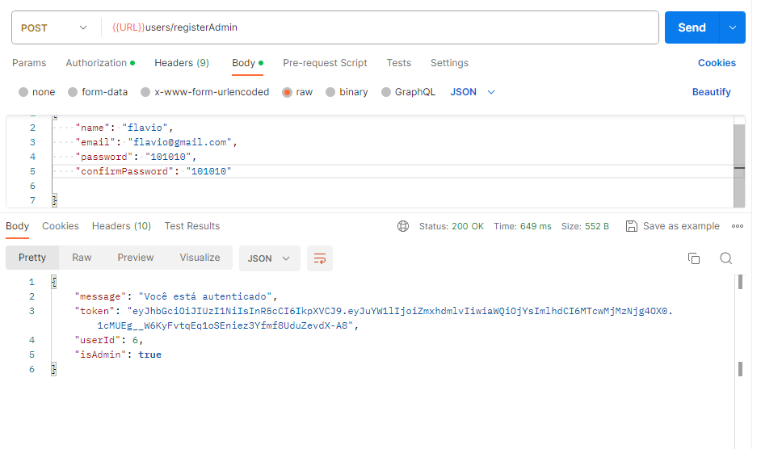
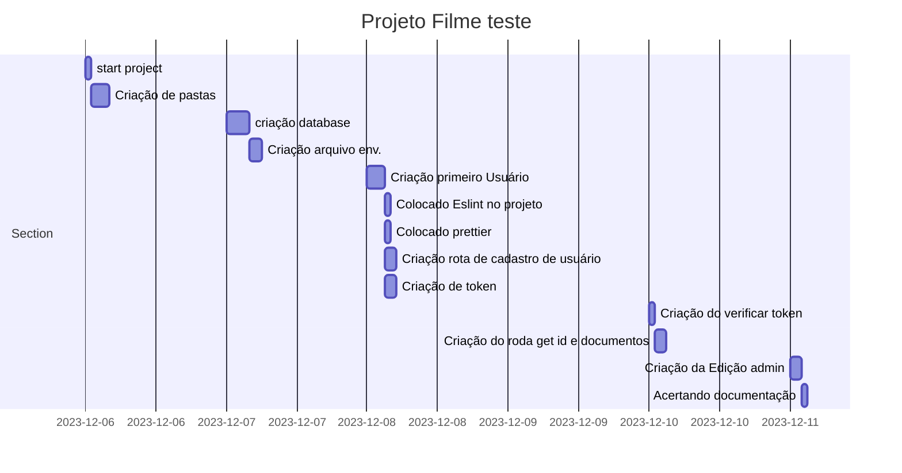

Projetos API Filmes
===


## Table of Contents

[TOC]

## Beginners Guide


#### Project initialization

1. Download or fork the project!
2. Install Node v18.15.0. 
3. Npm install , npm i command to download project dependencies.
4. Install database PostgreSQL , Port: 5432 , Version: 16.1
5. Create database with "dpproject" name.
6. create a .env file as shown below
6. NPM start para iniciar na porta 5000

#### Inicialização do projeto
1. Baixe ou faça um fork do projeto!
2. Instale o Node v18.15.0
3. Instalação npm , comando npm i para baixar dependências do projeto.
4. Instale o banco de dados PostgreSQL, Porta: 5432, Versão: 16.1
5. Crie um banco de dados denominado dpproject.
6. Crie um arquivo .env conforme mostrado abaixo.
6. O NPM inicia a inicialização na porta 5000

## Arquivo .env


```gherkin=
# DATABASE
DB_HOST=localhost
DB_USER=postgres
DB_PASSWORD=123456
DB_NAME=dpproject
DB_PORT=5432

# FIRST ADMIN USER 
FIRST_NAME=admin
FIRST_EMAIL=admin@admin.com
FIRST_PASSWORD=123456

#create user token
SECRET=asder145@45%67
```
### Banco de dados com primeiro usuário criado.


### Criação de primeiro usuário ADMIN pelo sistema.

```gherkin=
Recurso: Criação do primeiro usuário administrador
     Regra: Cadastro de administrador do sistema, só pode ser feito por admin.
     Portanto o sistema tem que criar um usuário padrão pela primeira vez no banco antes de ter outros usuários administradores.
  

     Cenário: Sistema cria usuário padrão
       permitindo a criação de mais usuários
```

### Mensagem no console depois de criado o banco e primeiro usuário admin
```gherkin=
[nodemon] restarting due to changes...
[nodemon] starting `node ./index.js localhost 5000`
Executing (default): SELECT table_name FROM information_schema.tables WHERE table_schema = 'public' AND table_name = 'Users'Executing (default): SELECT i.relname AS name, ix.indisprimary AS primary, ix.indisunique AS unique, ix.indkey AS indkey, array_agg(a.attnum) as column_indexes, array_agg(a.attname) AS column_names, pg_get_indexdef(ix.indexrelid) AS definition FROM pg_class t, pg_class i, pg_index ix, pg_attribute a WHERE t.oid = ix.indrelid AND i.oid = ix.indexrelid AND a.attrelid = t.oid AND t.relkind = 'r' and t.relname = 'Users' GROUP BY i.relname, ix.indexrelid, ix.indisprimary, ix.indisunique, ix.indkey ORDER BY i.relname;
Executing (default): SELECT "id", "name", "email", "password", "isAdmin", "createdAt", "updatedAt" FROM "Users" AS "User" WHERE "User"."isAdmin" = true LIMIT 1;
O administrador já existe
O servidor está rodando na porta 5000
```

### Criação de usuário administrador.

```gherkin=
Feature: Criação de usuário administrador 

  # Usuário Administrador 
  Regras : Um usuário administrador só pode ser criado por outro ADMIN.

  Cenário: Não passa o nome 
  Envia um mensagem de falha
   - Não é passado o email 
   Envia mensagem de falha 
   - Email igual de outra usuário !
   Envia mensagem para mudar 
   - Senha em vazio 
   Mensagem de Erro 
   - Senha diferentes 
   Mensagem de Erro 

   Quando tiver passado Nome , Email e senha corretos e validados 
   Criar novo Admin 
   Passar token e userid .
   isAdmin : true para front end 


```

#### Print do postman de register Admin



User story
---

```gherkin=
Feature: Guess the word

  # The first example has two steps
  Scenario: Maker starts a game
    When the Maker starts a game
    Then the Maker waits for a Breaker to join

  # The second example has three steps
  Scenario: Breaker joins a game
    Given the Maker has started a game with the word "silky"
    When the Breaker joins the Maker's game
    Then the Breaker must guess a word with 5 characters
```
> I choose a lazy person to do a hard job. Because a lazy person will find an easy way to do it. [name=Bill Gates]


```gherkin=
Feature: Shopping Cart
  As a Shopper
  I want to put items in my shopping cart
  Because I want to manage items before I check out

  Scenario: User adds item to cart
    Given I'm a logged-in User
    When I go to the Item page
    And I click "Add item to cart"
    Then the quantity of items in my cart should go up
    And my subtotal should increment
    And the warehouse inventory should decrement
```

> Read more about Gherkin here: https://docs.cucumber.io/gherkin/reference/

User flows
---
```sequence
Postman->Sistema: Requisição POST em json
Note right of Sistema: Sistema thinks
Sistema-->Postman: Retorna !
Note left of Postman: Postman responds
```

> Read more about sequence-diagrams here: http://bramp.github.io/js-sequence-diagrams/

Project Timeline
---


> Read more about mermaid here: http://mermaid-js.github.io/mermaid/

## Appendix and FAQ

:::info
**Find this document incomplete?** Leave a comment!
:::

###### tags: `Templates` `Documentation`

